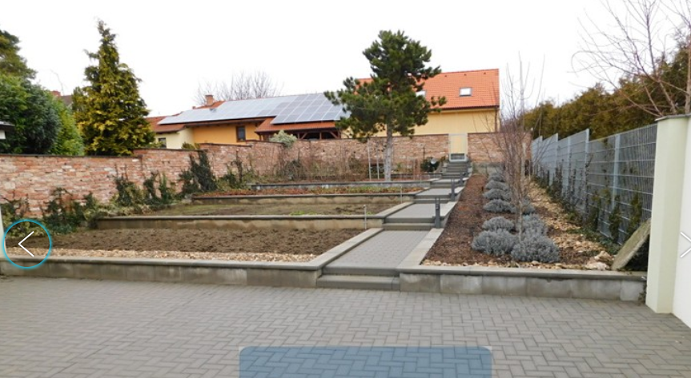
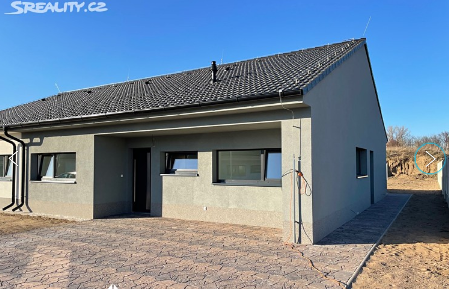
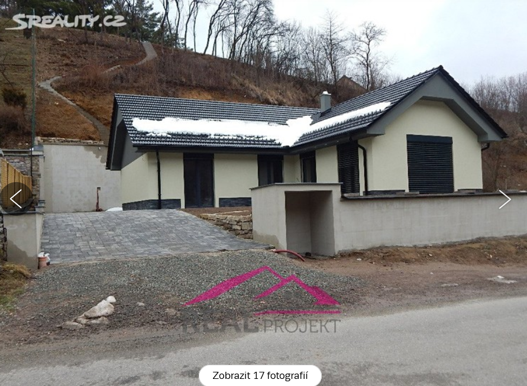
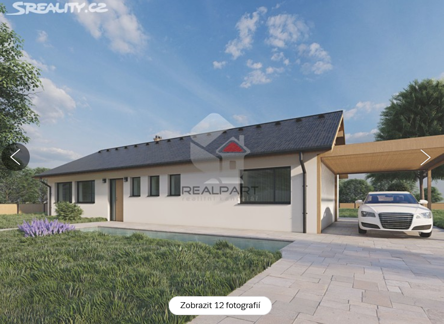
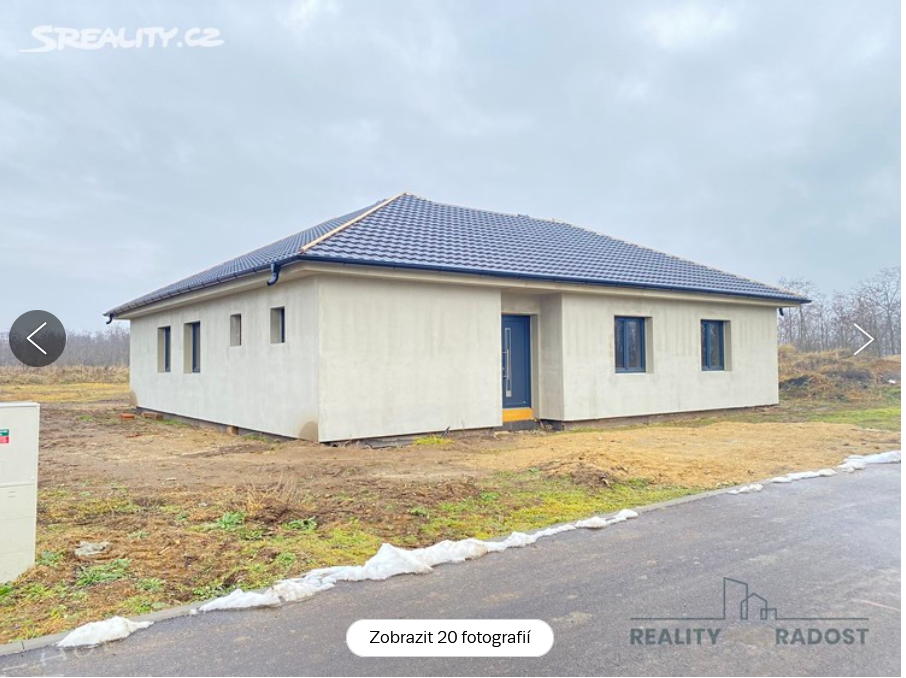
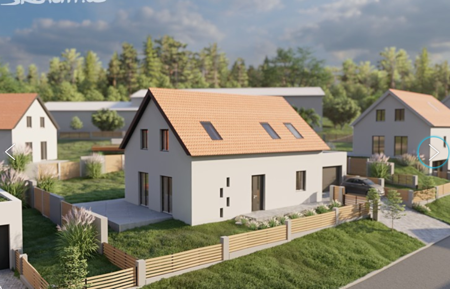
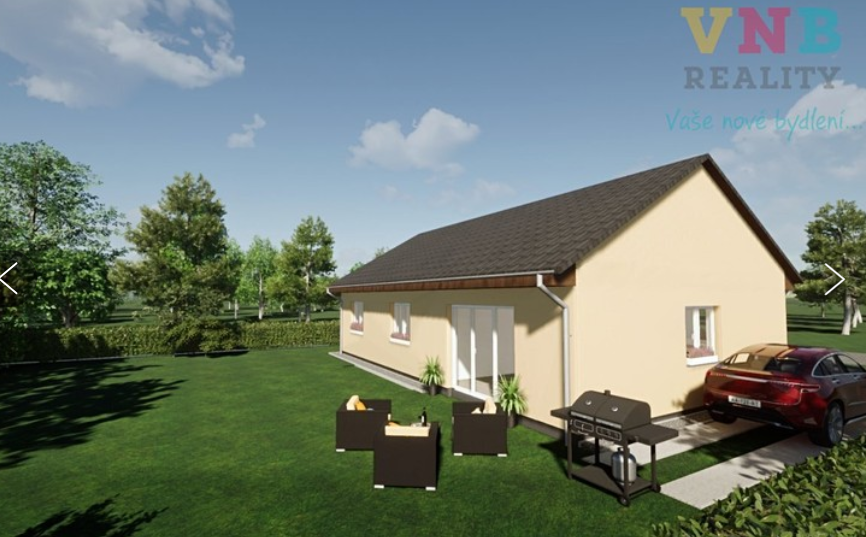
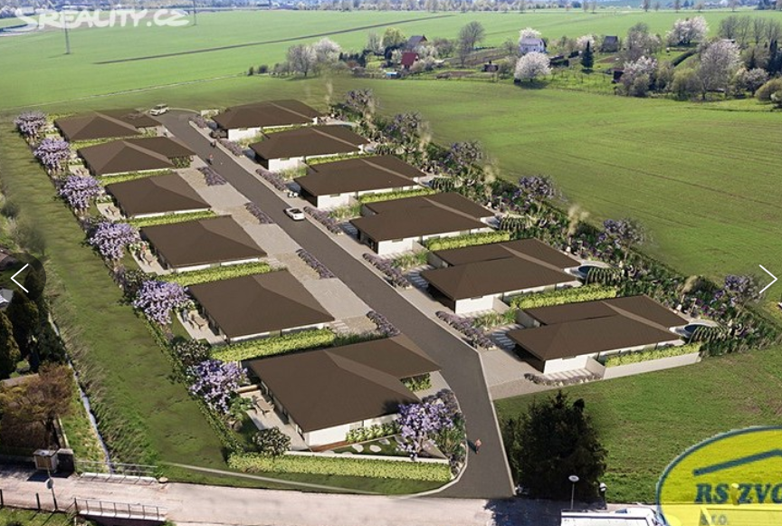
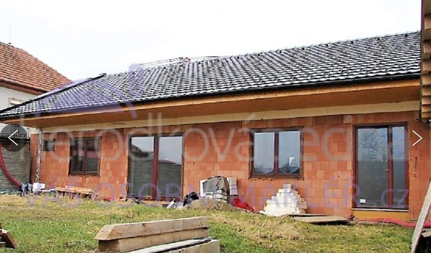
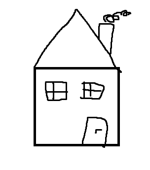

## [Tvořihráz, okres Znojmo](https://www.sreality.cz/detail/prodej/dum/rodinny/tvorihraz--/842344540)

**8 400 000 Kč (+ provize RK)**

**1 hodina**

>Nabízíme k prodeji novostavbu zděného rodinného domu v obci Tvořihráz, okr. Znojmo. Dům s dispozicí 4+kk, zahradou a dvojgaráží je zasazen do původní, řadové zástavby, je dořešen do posledního detailu, včetně zahrady, a noví majitelé budou jen bydlet. Dům je vystavěn s důrazem malou energetickou náročnost, provozní náklady celého jsou cca 4.000 Kč/měs., je připojen na veřejný vodovod, kanalizaci a elektřinu. Na pozemku je vlastní studna. Vytápění domu zajišťuji infrapanely, které doplňuje krb v obývacím pokoji. Krb je obsluhován ze zvláštní místnosti u vstupní chodby, tzn. že si v obývacím pokoji užíváte teplo krbu bez nepořádku. Obytná část domu je rozdělena do dvou podlaží, v 1.NP podlaží je vstupní chodba se vstupem do místnosti pro obsluhu krbu, technická místnost s pračkou a sušičkou, koupelna s vanou a sprchovým koutem – 9 m2, samostatná toaleta i s pisoárem, ložnice se dvěma šatnami, obývací pokoj s kuchyní a jídelnou – 39 m2. Z obývacího pokoje je vstup přilehlou terasu – 40 m2. Ve 2.NP jsou dva pokoje – 17, 16 m2 a toaleta. Celý dům je klimatizován. Před domem je dvojgaráž, třetí auto může případně parkovat v krytém průjezdu na dvůr. Mezi domem a zahradou je dílna. Zahrada má vytvořené terasy, chodníky a na konci ještě jednu oddechovou zónu. Plocha zahrady je 203 m2, celého pozemku 624 m2. Dům je ihned volný.
- klimatizovany, upravena zahrada
### Kontakty
### Status
- 15.3.2022 poslany mail realitke kedy sa da obhliadka
### Otazky
- Zapisy v katastri (zavazek neumoznit zapis noveho zast. prava misto stareho, zavazek nezajistit zast. pravo ve vyhodnejsim poradi novy dluh, zavazek zastavniho veritele nepozadat o vymaz zastav. prava)?
## [Hevlín, okres Znojmo](https://www.sreality.cz/detail/prodej/dum/rodinny/hevlin-hevlin-/4114086236)

**6 350 000 Kč (Cena je včetně provize, provizi platí prodávající)**

**1 hodina**
>Exkluzivně nabízíme k prodeji nízkoenergetickou novostavbu rodinného domu 4+kk v Hevlíně v okrese Znojmo. Jedná se o přízemní dům, který je součástí dvojdomu. Celková podlahová plocha domu včetně terasy činí 106,6 m2. Celková plocha pozemku je 570 m2 (zastavěná plocha 136 m2 a zahrada 434 m2)
Dispozice domu:
Vstupní chodba 4,6 m2, technická místnost 5,5 m2, obývací pokoj s kuchyňským koutem 34,9 m2, ložnice 12,9 m2, pokoj 14 m2 a další pokoj 12,7 m2, koupelna 7,1 m2 a terasa 14,9 m2. V koupelně je vana i sprcha. Celková podlahová plocha domu je 106,6 m2 včetně terasy 14,9 m2. K domu náleží pozemek před domem se zámkovou dlažbou připravený na parkování a oplocená zahrada za domem - celkem 434 m2. Na terasu je vyvedena elektřina i voda v nezámrzném systému.
Dům je postaven z Ytongu 30, celý dům je zateplen polystyrénem 20cm, strop je zateplený speciální foukanou izolací 35 cm, okna jsou plastová s trojskly, na podlahách dlažba nebo zátěžový vinyl. Střecha sedlová, taška KM Beta Prima. Zámkové dlažby na terase a před domem od firmy Best.
Topení a ohřev vody: plynový kotel - podlahové vytápění v celém domě. Se spotřebou energií spadá dům do kategorie B. Celá nemovitost je postavena z kvalitních a nadstandardních materiálů - velkoformátové dlažby a obklady, sprchový kout bez vaničky, fasádní omyvatelná omítka s protiplísňovou úpravou a další.
Dům je součástí dvojdomu a mezi samostatnými zdmi těchto dvou domů je navíc protihluková vata, což zaručuje kromě vynikající tepelné izolace především nadstandardní akustický komfort, takže nebudete sousedy nijak rušeni.
K domu náleží jedno vyhrazené parkovací místo před domem a na ulici je možné volně parkovat další auta.
Dům je napojen na veškeré sítě a je připraven k okamžitému nastěhování. Součástí stavby jsou i kompletně hotové venkovní úpravy (zámková dlažba, příjezdová asfaltová cesta, srovnaný terén před i za domem a přístupové chodníky).
Obec Hevlín má velmi dobrou dopravní dostupnost do Rakouska a do Znojma. Do Brna trvá cesta autem jen 45 minut. V Hevlíně žije zhruba 1.500 obyvatel a má plnou občanskou vybavenost - mateřská škola, základní škola až do deváté třídy, několik obchodů a restaurací.

- poznamka 1

### Kontakty
- RK
>Eliška Sladká
>+420 724 705 706
>reality@matiti.cz
### Status
- 15.3.2022 poslany mail realitke kedy sa da obhliadka
- Realitacka posle emailom niekolko terminov na vyber

### Otazky
- hé?

## [# Doubravník, okres Brno-venkov](https://www.sreality.cz/detail/prodej/dum/rodinny/doubravnik--/3814209628)

**7 990 000 Kč**

**0,5 hodiny**
>Jako přímý projektant tohoto domu nabízím k prodeji samostatně stojící jednopodlažní novostavbu nízkoenergetického rodinného domu před dokončením dispoziční velikosti 4 + kk (zastavěná plocha 136 m2, užitná plocha 105 m2, obytná plocha 82 m2) v obci Doubravník. Stavba je situována na pozemcích o celkové ploše 989 m2 (z toho je 136 m2 zastavěno RD). Součástí prodeje je skladovací objekt s hygienickým zázemím na pozemku stavby.
Stavba je řešena jako zděná z pórobetonových tvárnic opatřených kontaktním zateplovacím systémem z polystyrenu. Rodinný dům je zastřešen sedlovou střechou. Okenní výplně, vstupní a balkonové dveře jsou provedeny jako plastové s izolačním trojsklem, střešní krytina je pálená keramická.
Rodinný dům je připojen k veřejnému řádu splaškové kanalizace a veřejnému vodovodnímu řádu. Přípojka NN je ze strany provozovatele distribuční soustavy v povolovacím řízení. Dešťové vody jsou zaústěny do vsaku na pozemku stavby.
Vytápění rodinného domu je dle projektové dokumentace uvažováno teplovodním podlahovým systémem s elektrokotlem. Ohřev TV je uvažován elektrickým zásobníkovým ohřívačem. V objektu je realizováno komínové těleso pro možnost instalace krbových kamen nebo obezdívky krbové vložky.
Dokončení rodinného domu zahrnuje provedení podlahových konstrukcí včetně nášlapných vrstev, keramických obkladů stěn hygienického zázemí, montáž interiérových dveří včetně obložkových zárubní, vybavení koupelny a WC zařizovacími předměty, dodávku a montáž elektrokotle a el. zásobníkového ohřívače, instalaci svítidel a kompletačních materiálů.
Rodinný dům jsem projektoval a následně zpracoval podklady pro povolení stavby. Mohu tedy poskytovat relevantní informace. Dále nabízím možnost zpracování podkladů pro závěrečnou kontrolní prohlídku stavby (kolaudaci), případně zapracovat změny při dokončení stavby oproti projektové dokumentaci. Bližší informace rád poskytnu. Poznámka k ceně: 7 990 000,-Kč/za nemovitost + 300 000,-Kč provize RK.
### Kontakty
### Status
### Otazky

## [Hevlín 2, okres Znojmo](https://www.sreality.cz/detail/prodej/dum/rodinny/hevlin--/77433180)

**7 400 000 Kč + provize**

**1 hodina**
>Cena uvedena včetně dokončení RD a kolaudace (zajistí majitel)!
Inzerát budeme průběžně aktualizovat a přidávat foto z průběhu výstavby.
Předpokládaný termín dokončení stavby + kolaudace : konec srpna 2022
Ve výhradním zastoupení majitele nabízíme k prodeji novostavbu RD (bungalov) o dispozici 4+1 v obci Hevlín, okr. Znojmo. Jedná se o jednopodlažní (samostatně stojící) nepodsklepený rodinný dům se sedlovou střechou. Dům je situovaný v klidné lokalitě zastavěné novými rodinnými domy.
Celková výměra pozemků činí: 1120 m2 - z toho zastavěná plocha RD 141,96 m2.
Užitná plocha RD: 112,3 m2.
Dispozice: zádveří, chodba, samostatné WC, koupelna s vanou a umyvadlem, obývací pokoj, 3 neprůchozí pokoje, kuchyň, spíž, technická místnost
Konstrukce: obvodové zdivo – cihla 30 cm + kontaktní zateplovací systém (EPS 15 cm). Podlahy: plovoucí + dlažba. Okna: trojsklo.
Vytápění domu + ohřev vody bude zajišťovat tepelné čerpadlo. V domě bude k dispozici příprava na instalaci krbových kamen + příprava na dodělání solárních panelů (můžeme za příplatek zajistit nad rámec kupní ceny).
Co bude dokončeno v rámci kupní ceny?
Podlahy, zárubně + dveře, koupelna s vanou a WC (včetně obkladů).
Příprava na kuchyňskou linku.
V dané lokalitě existuje technická a dopravní infrastruktura (elektřina, vodovod, kanalizace), ke které bude připojen objekt RD.
K RD náleží 2 parkovací stání (ve vlastnictví majitele).
V obci Hevlín žije cca 1400 obyvatel a nachází se zde obecní úřad, pošta, restaurace, ubytování, MŠ + ZŠ, Jednota, Enapo (smíšené zboží + potraviny), dětské hřiště atd…
Dobrá dostupnost do Hrušovan nad Jev. (9 km), města Laa v sousedním Rakousku (3,7 km), Pasohlávek (24 km) a Mikulova (25 km).
V případě Vašeho zájmu Vám nezávazně zjistíme možnosti financování nemovitosti (spolupracujeme s cca 11 bankami a máme zajímavé podmínky).
Více informací telefonicky nebo emailem u makléřky.
Cena činí 7.400.000 Kč + provize.
*) V případě více zájemců si prodávající vyhrazuje právo výběru kupujícího dle svého uvážení.
### Kontakty
### Status
### Otazky

## [Šanov, okres Znojmo](https://www.sreality.cz/detail/prodej/dum/rodinny/sanov--/3251915356)

**6 326 700 Kč**

**1 hodina**
>Ve výhradním zastoupení majitele vám nabízím k prodej dům v Šanově o dispozici 5+kk s pozemkem 1051 m2. Jedná se o rovinatý terén. Dům se prodává jako hrubá stavba, jejíž součástí je terasa 20m2, střecha a kvalitní okna s trojsklem. Dům je zateplen 16cm polystyrénem, který je natažen do perlinky a lepidla. V domě jsou vystavěny příčky. Velkou výhodou je možnost napojení domu na optický datový kabel. Na přání zákazníka může firma dům dostavět podle jeho představ. Hrubá stavba je již dokončena a v tomto stavu se prodává. Cenovou nabídku dostavby firmou si můžete vyžádat u makléře. Domek se nachází pár minut od úplné základní školy. V této lokalitě je lesopark, kde jsou cyklotrasy vhodné na in-line brusle, kolo či procházku a sportcentrum. Pokud vás naše nabídka zaujala, neváhejte kontaktovat makléře. Případně vám pomůžeme i s financováním této nemovitosti.
### Kontakty
### Status
### Otazky

## [Výrovice, okres Znojmo](https://www.sreality.cz/detail/prodej/dum/rodinny/vyrovice--/2054453340)

**8 068 000 Kč**

**1 hodina**
>Rezidenční výstavba moderních domů Domy Výrovice dává prostor celé rodině. Cílem projektu je výstavba velkoryse řešených domů praktických dispozic, které budou splňovat představy a požadavky náročných majitelů. V novém projektu Domy Výrovice bude vybudováno celkem 7 nových rodinných domů s uspořádáním 5+kk, kde je možno vybírat ze dvou typů domů o velikosti 202 m² - 236 m² podlahové plochy. Ke každému domu náleží pozemek o průměrné velikosti 650 m² a garáž pro 2 auta.
V rámci projektu Vám nabízíme k prodeji rodinný dům č. 1, o dispozici 5+kk a podlahové ploše 202 m2. Jedná se o novostavbu dvoupodlažního domu s garáží pro 2 auta, parkovacím stáním a zahradou o velikost 643 m2.
V přízemí se nachází prostorný obývací pokoj s kuchyní a přímým vstupem na terasu zahrady; pracovna/pokoj, WC, technická místnost, garáž a sklad. V 2. nadzemním podlaží jsou situovány 3 ložnice, prostorná koupelna a šatna.
Dům bude dokončen ve variantě standardu dle výběru nového majitele.
Dokončení a předání výstavby je do 12 měsíců od uzavření Smlouvy o smlouvě budoucí kupní. Pro informace o standardech a technickém vybavení domu neváhejte volat. Cena je uvedena za kompletně dokončený dům ve standardu, včetně oplocení zahrady.
Soubor samostatně stojících rodinných domů je ideálním bydlením pro všechny, kteří hledají pohodlný a klidný styl života v těsném dosahu města Znojma.
Obec Výrovice leží cca 13km severně od města Znojma a cca 65 km od Brna, údolí nad obcí vyplňuje Výrovická přehrada. Obec je významnou rekreační oblastí regionu.

### Kontakty
### Status
### Otazky

## [Lešany, okres Prostějov](https://www.sreality.cz/detail/prodej/dum/na-klic/lesany-lesany-/4009188188)

**6 172 522 Kč**

**1 hodina**
>Pokud hledáte bydlení v klidné lokalitě, máme právě pro Vás vhodnou nabídku. Nabízíme Vám dům, který splní Vaše veškerá očekávání. Jedná se o novostavbu rodinného domu 4+kk ( popř.5+kk), se sedlovou střechou, který je součástí projektu výstavby osmi solitérních domů, nízkoenergetických dřevostaveb, s vysokou kvalitou provedené práce i použitých materiálů . Projekt je situován v centru obce Lešany. Domy jsou navržené tak, aby vytvořily ulici, v níž bude radost bydlet. Jsou umístěné tak, aby obyvatelé každého z nich měli maximum soukromí na své zahradě a možnost ji plnohodnotně využívat. Nabízený dům má užitnou plochu 94 m2, je situován na vlastním pozemku o velikosti cca 686 m2. Prakticky navržená dispozice poskytne budoucímu majiteli naprosté pohodlí. Vstup do domu je přes chodbu, ve které je počítáno s prostorem pro šatní skříň. Z ní vedou dveře do technické místnosti a do další chodby, ze které se vchází do prosvětleného a prostorného obývacího pokoje s kuchyní, který je koncipovaný jako organický celek určený pro společné chvíle se vstupem na zahradu. Z chodby vedou dveře dále do koupelny s WC a do tří samostatných pokojů, které poskytnou klid a soukromí jednotlivým členům rodiny. Dispozici můžete vybírat ze čtyř připravených variant.
V rámci projektu bude vybudovaná nová komunikace s parkovacími stáními a přípojkami vodovodu, kanalizace, elektřiny i plynu.
Projekt je v přípravě, takže jsou možné dispoziční změny dle přání klienta.
Do Lešan se dostanete po 8 min jízdy autem z Prostějova, 27 min z Olomouce a do blízkého Kostelce na Hané, kde je veškerá občanská vybavenost, Vám bude stačit 5 min.
Výše uvedená cena je za pozemek 686 m2 , výstavbu RD ke kompletnímu dokončení a provizi RK. Cena za dokončený dům včetně zařizovacích předmětů sanity, obkladů, dlažby, podlahové krytiny PVC, vnitřních dveří a výmalby interiérů je 6.556.658,- Kč. Další podrobnosti na www.domylesany.cz.
Lze financovat hypotečním úvěrem s měsíční splátkou 23.542,- Kč se splatností 30 let. Financování zajistíme přes našeho finančního specialistu a můžeme Vám pomoci i s prodejem Vaší stávající nemovitosti. Pro více informací nás neváhejte kontaktovat.
### Kontakty
### Status
### Otazky

## [Doubí, Přerov - Přerov XI-Vinary](https://www.sreality.cz/detail/prodej/dum/rodinny/prerov-prerov-xi-vinary-doubi/1392769116)

**5 777 800 Kč (bez provize RK)**

**1 hodina 10 minut**
>K prodeji hrubá stavba sam. stoj. RD s pozemkem, ve vyjimečné lokalitě- pod čekyňským kopcem. Přírodní lokalita na okraji obce Vinary, s výbornou dostupností do PR i Ol., s napojením na dálnici D 1. V nabídce 3 varianty RD (4+kk s 2-gar., 4+kk bez gar., 5+kk s 2-gar.) Počátek stavby jaro 2022, dokončení dle požadavku kupujícího. Možnost dokončení celé stavby na klíč. Pro kupujícího možnost ovlivnit volbu uspořádání příček, podlahových krytin, obkladů stěn, zařizovacích předmětů, dveří, kuchyňské linky, maleb. Prodejní cena je cena vč. DPH, (bez provize RK) hrubé stavby domu, pozemku pod domem a okolo domu, dopravní a technické infrastuktury. V ceně hrubé stavby je : zákl. deska, svislé nosné zdivo, příčky, vazníkový krov vč. zastřešení plechové šablony, okapy, 5-ti komorová okna Vekra, vchodové dveře bezp. tř. 3, garážová vrata. Přípojky inž. sítí přivedeny ke stavbě domu. Podrobnější informace k výstavbě na vyžádání. K dispozici 8 domů, další 4 domy již prodány. PENB B.
### Kontakty
### Status
### Otazky

## [Chvalnov-Lísky, okres Kroměříž](https://www.sreality.cz/detail/prodej/dum/rodinny/chvalnov-lisky--/3154528348)

**6 200 000 Kč**

**1 hodina**
>Nabízíme k prodeji nadstandardní novostavbu přízemního rodinného domu dispozičně řešenou jako 4+kk s prostornou garáží a letní kuchyní v krásném prostředí na úpatí vrchoviny Chřiby v obci Chvalnov. Vstup do domu je chodbou, následuje obývací pokoj s kuchyňským koutem, pokoj, ložnice s prostornou šatnou, koupelna s plánovanou vanou, sprchovým koutem, umyvadlem a WC. V technické místnosti je příprava na instalaci centrálního vysavače, kombinovaného elektrokotle s akumulační nádobou na TUV, ventilového systému podlahového vytápění a umístěním pro pračku se sušičkou. Dále je samostatný pokoj s koupelnou s plánovaným sprchovým koutem, umyvadlem a WC. Garáž s elektrickými rolovacími garážovými vraty je prostorná pro parkování dvou aut a skladování. Dům ve tvaru písmene "L" vystavěný z broušeného cihelného bloku Porotherm s kvalitními dřevěnými bezúdržbovými okny s trojskly splňuje parametry nízkoenergetického domu. Podlahy jsou betonové a na stropech je nainstalována konstrukce pro montáž sádrokartonových stropů. Vytápění domu a ohřev TUV je plánováno kombinovaným elektrokotlem s napojením na teplovodní podlahové vytápění a krbovými kamny v obývacím pokoji. Všechny pokoje budou klimatizovány, ve všech jsou rozvody centrálního vysavače a optického kabelu. V domě je třífázová elektřina, plyn je přivedený do domu a odpady jsou napojeny na domovní ČOV. Dům je také připojený na hloubenou studnu pro čerpání užitkové vody a ze které je také voda rozvedena pro zavlažování zahrady. V křídle domu je letní kuchyně s přípravou na koupelnu se sprchovým koutem, umyvadlem, WC, kuchyňskou linku, vstup do sklepa (9 m2) a místnost na dílnu. Za domem je velká oplocená zahrada, na kterou celý den svítí slunce, osázená ovocnými stromy s hospodářskou budovou, skleníkem, udírnou, ohništěm a s krásným výhledem na vrchovinu Chřiby a na přilehlý rybník s možností rybolovu. Z obce je velmi dobré napojení na silnici E50 3,5 km (3 min.) Vzdálenost do Brna je 54 km (49 min.) a do Uherského Hradiště 27 km (24 min.).
- Chvalnov 58
- Vymierajuca dedina typu Polanovce (250 obyvatelov)
### Kontakty
### Status
### Otazky

## [Template](dummy.link)

**Cena**

**vzdialenost**
>Popis
### Kontakty
### Status
### Otazky