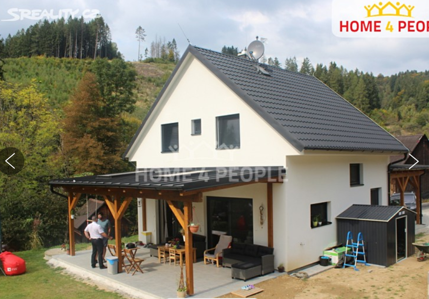

## [Hevlín, okres Znojmo](https://www.sreality.cz/detail/prodej/dum/rodinny/hevlin-hevlin-/4114086236)

**6 350 000 Kč (Cena je včetně provize, provizi platí prodávající)**

**1 hodina**
>Exkluzivně nabízíme k prodeji nízkoenergetickou novostavbu rodinného domu 4+kk v Hevlíně v okrese Znojmo. Jedná se o přízemní dům, který je součástí dvojdomu. Celková podlahová plocha domu včetně terasy činí 106,6 m2. Celková plocha pozemku je 570 m2 (zastavěná plocha 136 m2 a zahrada 434 m2)
Dispozice domu:
Vstupní chodba 4,6 m2, technická místnost 5,5 m2, obývací pokoj s kuchyňským koutem 34,9 m2, ložnice 12,9 m2, pokoj 14 m2 a další pokoj 12,7 m2, koupelna 7,1 m2 a terasa 14,9 m2. V koupelně je vana i sprcha. Celková podlahová plocha domu je 106,6 m2 včetně terasy 14,9 m2. K domu náleží pozemek před domem se zámkovou dlažbou připravený na parkování a oplocená zahrada za domem - celkem 434 m2. Na terasu je vyvedena elektřina i voda v nezámrzném systému.
Dům je postaven z Ytongu 30, celý dům je zateplen polystyrénem 20cm, strop je zateplený speciální foukanou izolací 35 cm, okna jsou plastová s trojskly, na podlahách dlažba nebo zátěžový vinyl. Střecha sedlová, taška KM Beta Prima. Zámkové dlažby na terase a před domem od firmy Best.
Topení a ohřev vody: plynový kotel - podlahové vytápění v celém domě. Se spotřebou energií spadá dům do kategorie B. Celá nemovitost je postavena z kvalitních a nadstandardních materiálů - velkoformátové dlažby a obklady, sprchový kout bez vaničky, fasádní omyvatelná omítka s protiplísňovou úpravou a další.
Dům je součástí dvojdomu a mezi samostatnými zdmi těchto dvou domů je navíc protihluková vata, což zaručuje kromě vynikající tepelné izolace především nadstandardní akustický komfort, takže nebudete sousedy nijak rušeni.
K domu náleží jedno vyhrazené parkovací místo před domem a na ulici je možné volně parkovat další auta.
Dům je napojen na veškeré sítě a je připraven k okamžitému nastěhování. Součástí stavby jsou i kompletně hotové venkovní úpravy (zámková dlažba, příjezdová asfaltová cesta, srovnaný terén před i za domem a přístupové chodníky).
Obec Hevlín má velmi dobrou dopravní dostupnost do Rakouska a do Znojma. Do Brna trvá cesta autem jen 45 minut. V Hevlíně žije zhruba 1.500 obyvatel a má plnou občanskou vybavenost - mateřská škola, základní škola až do deváté třídy, několik obchodů a restaurací.

- poznamka 1

### Kontakty
- RK
>Eliška Sladká
>+420 724 705 706
>reality@matiti.cz
### Status
- 15.3.2022 poslany mail realitke kedy sa da obhliadka
- Realitacka posle emailom niekolko terminov na vyber
- Obhliadka done
	- Je to dost z ruky, ale zakladne veci v dedine su
	- Bude treba
		- Fotovoltaika
		- Klima
		- Casom mozno kozub
		- Kuchyna
		- Zahrada

### Otazky
---
## [Hostěradice - Chlupice, okres Znojmo](https://www.sreality.cz/detail/prodej/dum/rodinny/hosteradice-chlupice-/3961252188)

**5 499 000 Kč + provize RK**

**50 minut**
>Ve výhradním zastoupením Vám nabízíme novou dřevostavbu 4+kk v malebné obci Hostěradice, postavenou v roce 2014. Obec je v krátké dojezdové vzdálenosti od města Znojma a 35 minut od Brna. Útulný dům je o dispozici 4+kk, celkové zastavěné ploše 103 m2 a užitné ploše 87 m2. Dva pokoje s výhledem do ulice mohou sloužit například jako pracovna a dětský pokoj. Obývací pokoj s kuchyní, orientovaný do zahrady, se vstupy na obě terasy, Vám naopak nabídne maximální soukromí. Kuchyňský kout je vybaven moderními, zabudovanými spotřebiči – troubou, lednicí, mikrovlnnou troubou a digestoří. Indukční deska a myčka jsou dokonce úplně nové z loňského roku. V obývacím pokoji jsou kvalitní kamna na pelety, která jsou připojena na elektřinu. Tento účinný a ekologický typ vytápění pak doplňují moderní elektrické přímotopy ve všech místnostech. Prosluněná ložnice je také orientovaná do klidu zahrady, užít si tak můžete dlouhé noci nerušeného spánku. V koupelně je jak vana, pro milovníky dlouhých koupelí, tak i sprchový kout. K domu náleží garáž s elektrickými vraty a přístřešek pro další parkování. Velká zahrada o rozloze 836 m2, s ovocnými stromky, je jinak doslova nepopsaným listem. Můžete zde trávit letní večery při posezení u ohniště, vystavět zde altán, pergolu nebo bazén, pro zahradníky je tu spousta prostoru pro záhony, nebo skleníky a stále zbývá místo pro radovánky s dětmi. Zůstává zde i příprava na jezírko a houpačka. Obec Hostěradice je malebná lokalita s dobrou občanskou vybaveností. Bývalí majitelé si pochvalovali, jaký tu panuje klid a soukromí. Asi 200 metrů uličkami mimo provoz jsou mateřská a základní škola (1. stupeň), velmi blízko jsou také obchody, lékárna, pošta, knihovna a restaurace. V obci je i kulturní dům, v jehož prostorách se nachází velký sál vhodný pro pořádání kulturních i společenských akcí, u „Starého lomu“ je i osada se zvířaty. Ke sportovnímu vyžití v obci slouží fotbalové hřiště, dětské hřiště hned vedle domu a školní tělocvična.
- je tam kozub
### Kontakty
**[Jakub Vokřál](https://www.sreality.cz/adresar/broker-consulting-a-s-plzen-vychodni-predmesti/18938/makleri/223406)**

-     +420 720 936 929
-     [okrealitnisluzby@bcas.cz](mailto:okrealitnisluzby@bcas.cz)
### Status
- Prehliadka 27.3. 12:30
### Otazky
---
## [# Benešov, okres Blansko](https://www.sreality.cz/detail/prodej/dum/rodinny/benesov--/1016437084)

**8 860 000 Kč (vratane 360k provizie)**

**45 minut**
>Rádi bychom Vám představili bydlení pro rodinu, které jste si vždy přáli. Jedinečný a velmi hezký bungalov s dispozicemi 4+kk na zastavěné ploše 144 m2 splňuje všechny požadavky k hezkému bydlení.
Hlavní výhody:
Rozlehlý obytný prostor s kuchyňským koutem
Tři samostatné pokoje oddělené chodbou
Moderní koupelna a samostatné WC
Technická místnost
Krbová vložka s rozvodem tepla do všech pokojů
Podlahové vytápění
Dům prošel v loňském roce modernizací všech podlah (vinyl), obložek, dveří a koupelny. Prostorná a světlá nemovitost má své kouzlo. Zaujmou Vás designové prvky, velká kuchyňská linka i luxusní koupelna. Vstup na rovinatou zahradu je z obývacího prostoru.
Zahrada má výměru cca 771 m2. Děti si jistě užijí prostor, zapuštěný bazén a dětskou chatku. Dospělý zase ocení zastřešenou pergolu u domu s hezkým pohledem.
Před domem je okrasný záhon a parkovací stání vydlážděné zámkovou dlažbou, kde může pohodlně zaparkovat i návštěva. K otvírání brány na pozemek slouží elektrický pohon vrat.
Obec Benešov leží pouze 12 km od Boskovic. Nachází na náhorní rovince Drahanské vrchoviny mezi vrcholy Paprčem a Skalkami. Je zde dobrá občasná vybavenost jako mateřská a základní škola, prodejna potravin, hospoda a zdravotní středisko. Okolní malebná krajina okouzlí všechny příznivce sportu nebo procházek.
- Maklerka hovori, ze s cenou sa da hybat "docela vyrazne", mame dat navrh. Povedal som, ze sa ozveme v horizonte 1-2 tyzdnov (tj do 8.4.)
### Kontakty
**[Veronika Mlčochová](https://www.sreality.cz/adresar/okno-nemovitosti-blansko/10024/makleri/94469)**

-     +420 731 139 583
-     [veronika.mlcochova@rkokno.cz](mailto:veronika.mlcochova@rkokno.cz)
### Status
- obhliadka 22.3. 15:00
### Otazky
---
## [Letovice - Zábludov, okres Blansko](https://www.sreality.cz/detail/prodej/dum/rodinny/letovice-zabludov-/337230172)

**6 795 000 Kč**

**37 minut**
>Dům se nachází ve fázi výstavby s termínem dokončení 6/2022, po dohodě se stavebníkem možné úpravy dle Vašich požadavků.
Jedná se o dvoupodlažní nemovitost s podlahovou plochou 173 m2 dvojgaráží v domě na pozemku o výměře 405 m2.
Výborná dopravní dostupnost do Letovic 2km, Boskovic 12 km, Svitav 25 km a Brna 35 km.
Cena je uvedena za dokončený RD na klíč, bez oplocení, kuchyňské linky a zahradních úprav. 
- Prehliadka 26.3. 10:30
### Kontakty
**Marrow Estate s.r.o. Marek Šášek**

-     +420 704 693 859
-     [marrowestate@email.cz](mailto:marrowestate@email.cz)
### Status
### Otazky
---
## [Nová, Morkovice-Slížany - Morkovice](https://www.sreality.cz/detail/prodej/dum/rodinny/morkovice-slizany-morkovice-nova/3518425436)

**7 580 000 Kč**

**50 minut**
>Novostavba rodinného domu. Jedná se o řadový, koncový, přízemní s obytným podkrovím, 5+kk s garáží. RD je kolaudován v roce 2016, je zděný z tvárnic YTONG tl.45 bez dodatečného zateplení, okna a dveře plastová s trojsklem, střecha sedlová, krytina plechová SATJAM, střešní okna plastová VELUX. Garáž je samostatně řešena jako dřevostavba. Dispozičně v přízemí : vstup, chodba se schodištěm, koupelna se sprchovým koutem + WC, komora, ložnice, obývací pokoj s kuchyní, v podkroví: 3 x pokoj, koupelna s rohovou vanou a sprchovým koutem + WC. Celková podlahová plocha je 110m2 + 21m2 garáž. Vytápění je elektřinou, podlahovým topením s topnými kabely s termostaty v každé místnosti, ohřev TUV je el. boilerem 125l. Ve dvou pokojích v podkroví je klimatizace. Ve dvorní části jsou tři přístřešky s možností posezení, vše vydlážděno zámkovou dlažbou. V zadní části je umístěna plechová hospodářská budova. Pozemek je komplet oplocen. Ve městě je komplet občanská vybavenost škola, školka, zdravotní středisko, městský úřad, koupaliště, sportovní areál.... Dostupnost na dálnici směr Brno nebo Zlín 7 km.
### Kontakty
**Stanislav Foltýn**

-     +420 777 109 138
-     [fol.stan@seznam.cz](mailto:fol.stan@seznam.cz)
### Status
### Otazky
---
## [Lhotsko, okres Zlín](https://www.sreality.cz/detail/prodej/dum/na-klic/lhotsko-lhotsko-/2407397980)

**6 645 500 Kč**

**1h 30min**
>Zprostředkujeme Vám exkluzivní prodej výstavby na klíč tipu Klára 5+kk, 93 m² na klíč v obci Lhotsko u Vizovic s pozemkem o velikosti 510 m², okres Zlín. Pozemek č.2 je mírně svažitý o rozměru cca 20 x 26m. Tento dům se sedlovou střechou je vhodný do nízké okolní zástavby. Jedná se o dřevostavbu, kdy je použita technologie plný Standard s energetickou třídou "A" a nabízí se ve variantě na klíč. Svými vnitřními prostory o užitné ploše 93 m² uspokojí nároky na bydlení 4-5 členné rodiny. Vhodná stavba o zastavěném rozměru 8x8m je ideální pro menší nebo úzké parcely. Topení je řešeno nízko nákladovým tepelným čerpadlem s kombinací rekuperace (řízené větrání). Díky energetické náročnosti je částka na provoz domu velmi nízká. Uvedená cena je za dům, pozemek, základovou desku, výstavbu inženýrských sítí, čističky odpadních vod a DPH. Cenou na klíč je myšleno veškeré poplatky za připojení, vyřízení stavebního povolení včetně nutné úhrady úřadům, nájezd k domu, parkovací stání, oplocení pletivem o výšce 1,8m, úprava terénu, zatravnění zahrady, projektové dokumentace a kolaudace. Po kolaudaci k okamžitému nastěhování. Obec Lhotsko je vyhledávaná lokalita se skvělou dostupností do okolních Vizovic, Zlína nebo Vsetína. Před pěti lety byl zprovozněn obchvat obce, tudíž se frekvence vozidel v obci snížila o 90 %. Financování zajistíme jak na pozemek, tak i na dům. Možnost změny stavebního materiálu na zděnou stavbu s doplatkem nebo dřevostavbu v plném standardu. Náklady na bydlení včetně vody cca do 2900,-Kč za měsíc. Délka výstavy cca 8 měsíců čistého stavebního času. Fotografie domu jsou ilustrativní ". Více typových domů najdete na zdenedomkynaklic.cz . V nabízené lokalitě je možné postavit pouze patrový dům a výstavba už dvou domů byla započata. Nabízím možnost si tento typový dům Klára prohlédnout v rozestavěném nebo hotovém stavu! Jedná se o poslední pozemek z této lokality. Ev. číslo: 29343.
### Kontakty
**[Petr Sedlařík](https://www.sreality.cz/adresar/home-4-people-ready-uhersky-brod/13495/makleri/49239)**

-     606 765 159
-     [sedlarik@home4people.cz](mailto:sedlarik@home4people.cz)
### Status
### Otazky
---
## [Březské, okres Žďár nad Sázavou](https://www.sreality.cz/detail/prodej/dum/rodinny/brezske--/3022411868)

**6 790 000 Kč (3 790 000 Kč + predpokladanych 3mil na dokoncenie)**

**35 minut**
>Nabízíme prodej dřevostavby 5+kk o celkové užitné ploše 149 m2 ve stupni hrubé stavby v obci Březské, 4km od Velké Bíteše a 25 min autem z Brna na pozemku parc.č.971/34 o celkové výměře 934m2. Stavba je situována v klidné části obce obklopené krásným prostředím lesů a rybníků. Předpokládané náklady na dokončení stavby jsou cca 1,9 mil Kč. Materiál na dostavbu nemovitosti v ceně 0,5 mil Kč je uskladněn v nemovitosti a je součástí kupní ceny.Stavební povolení končí v roce 2023. V obci se nachází obchod, mateřské školka, pohostinství. Ostatní občanská vybavenost je v nedaleké Velké Bíteši.V případě zájmu zajistíme stavební firmu k dokončení RD. Cena za nemovitost je 3 790 000,- Kč včetně pozemku.Uvedená cena je platná pouze do konce března 2022! V případě zájmu si sjednejte prohlídku s našim makléřem. Financování je zajištěno.
- Cca 3-4 mesiace na dokoncenie stavby
- Prehliadka 26.3. 14:00
### Kontakty
- Pan Toman
### Status
### Otazky
---
## [Template](dummy)

**Cena**

**vzdialenost**
>Popis
### Kontakty
### Status
### Otazky
